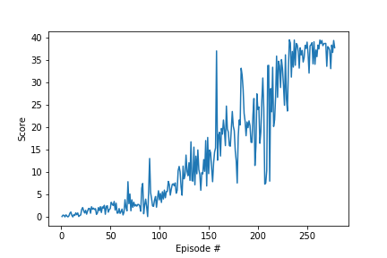

# Report: Project 2 - Continuous Control

The report contains the algorithm used to train the RL agent along with the resulting plot containing
the scores obtained by the agent over the episodes.

### Learning Algorithm
In order to select a suitable algorithm for this environment we need to consider the 
action space. The action space is continuous because each action is a vector with four numbers, corresponding to torque applicable to two joints and every entry in the action vector is a number between -1 and 1.
Because of this reason DQN which is value based algorithm can not be used. We need a different class of policy based algorithms
that can handle continuous action spaces.

#### Deep Deterministic Policy Gradient (DDPG)

**DDPG** is a policy based Actor-Critic algorithm that has an Actor Network which directly learns the optimal policy whereas Critic Network utilizes the 
value based method to learn to estimate the action value function Q(s, a) for the state, action pairs.
This helps to leverage the best of both worlds, hence we get a more stable algorithm than a value-based approach and requires less training examples than a policy-based approach.
Here we use a local and a target network for each actor and the critic.
This implementation is the extension of the ddpg-pendulum implementation of the course. 

**Experience replay**<br/>
Experience replay is achieved by storing the previous experience the RL agent had
as a state, action, reward, and next state (s, a, r, s') tuple.
These samples are randomly drawn as a training data for the neural network
in order to break the correlation between them. This helps to use the valauable experiences the agent had rater than throwing them away immediately.
In this implementation instead of learning and updating the weights at every time step, which resulted in instability during the training, the agent is made to learn after a certain steps.

**Hyper-parameters**

- BUFFER_SIZE = int(1e5)  # replay buffer size
- BATCH_SIZE = 128        # minibatch size
- GAMMA = 0.99            # discount factor
- TAU = 1e-3              # for soft update of target parameters
- LR_ACTOR = 1e-2         # learning rate of the actor 
- LR_CRITIC = 1e-4        # learning rate of the critic
- WEIGHT_DECAY = 0        # L2 weight decay 
- LEARN_TIMES = 10        # how many samples to learn
- UPDATE_EVERY = 20       # how often to update the network
- mu=0.                   # long running mean in the Ornstein-Uhlenbeck process
- theta=0.15              # speed of mean reversion in the Ornstein-Uhlenbeck process
- sigma=0.15              # volatility parameter in the Ornstein-Uhlenbeck process

**Neural Network Architecture**  
For the actor network, the state space size is 33 variables, therefore the input layer size is also 33.
The hidden layers sizes are 400 and 300 and since the action space size is 4 the output size of the NN is also 4.

The critic network takes the state space of size 33 and action space of size 4. The first layer takes the observations and the output is concatenated with the actions and send to the 
second hidden layer. This will be used to estimated the action-value function hence the output size will be 1.

```
Actor(
  (fc1): Linear(in_features=33, out_features=400, bias=True)
  (bn1): BatchNorm1d(400, eps=1e-05, momentum=0.1, affine=True, track_running_stats=True)
  (fc2): Linear(in_features=400, out_features=300, bias=True)
  (bn2): BatchNorm1d(300, eps=1e-05, momentum=0.1, affine=True, track_running_stats=True)
  (fc3): Linear(in_features=300, out_features=4, bias=True)
)
Critic(
  (fcs1): Linear(in_features=33, out_features=400, bias=True)
  (bn1): BatchNorm1d(400, eps=1e-05, momentum=0.1, affine=True, track_running_stats=True)
  (fc2): Linear(in_features=404, out_features=300, bias=True)
  (fc3): Linear(in_features=300, out_features=1, bias=True)
)
```


**Plot of Rewards**

The following plots shows the rewards per episode  
  
The agent is able to solve the environment in 278 episodes!

```

t 999       Episode 272 (00m28s)	Average Score: 28.97
t 999       Episode 273 (00m29s)	Average Score: 29.14
t 999       Episode 274 (00m28s)	Average Score: 29.24
t 999       Episode 275 (00m29s)	Average Score: 29.42
t 999       Episode 276 (00m28s)	Average Score: 29.60
t 999       Episode 277 (00m27s)	Average Score: 29.84
t 999       Episode 278 (00m28s)	Average Score: 30.09

Environment solved in 278 episodes! (02h15m01s) 	Average Score: 30.09
```


### Ideas for Future Work
In this project a DDPG algorithm with an Experience Replay buffer is used. As a future work, we can add Prioritized experience replay buffer and also the 20 agent environment can be used with algorithms like
- TRPO (Trust Region Policy Optimization)
- PPO (Proximal Policy Optimization)
- A3C (Asynchronous Advantage Actor-Critic)
- D4PG (Distributed Distributional Deterministic Policy Gradients)


These can be help to solve the environment efficiently.
